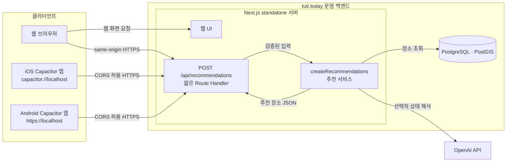

# Capacitor API Architecture

Tuti는 같은 소스코드에서 웹과 앱을 함께 가져간다. 웹은 Next.js standalone 서버로 배포하고, 앱은 Capacitor가 정적 빌드 산출물을 감싸는 구조를 기준으로 한다.

## 결정

- 웹 빌드는 Next.js standalone으로 배포한다.

- 앱 빌드는 Next.js static export 결과물인 `out/`을 Capacitor `webDir`로 사용한다.

- `src/app`은 화면과 Next 라우팅을 담당한다.

- `src/app/api/**/route.ts`는 웹 서버용 얇은 route adapter로만 사용한다.

- 앱 빌드는 `.app-build/`에 일회성 소스 투영본을 만들고 `src/app/api`, `src/server`, `src/generated`를 제외한다.

- 서버 로직은 `src/server` 아래에 둔다.

- 앱과 웹이 함께 써도 되는 타입, 순수 계산, fallback 로직은 `src/shared` 또는 클라이언트 번들에 들어가도 안전한 모듈에 둔다.

## 전체 아키텍처

### 런타임 구조



웹과 Capacitor 앱은 모두 `tuti.today`의 동일한 Route Handler를 사용한다. 차이는 웹 요청은 same-origin이고 앱 요청은 WebView origin에서 들어오는 cross-origin이라는 점뿐이다.

### 빌드 파이프라인

```mermaid
flowchart TB
  subgraph source[하나의 원본 저장소]
    pages[src/app/(tuti)<br/>공통 화면 라우트]
    api[src/app/api<br/>웹 Route Handler]
    server[src/server · src/generated<br/>DB·OpenAI 서버 코드]
    client[src/features · src/lib<br/>src/store · src/styles]
    shared[src/shared<br/>API 계약·공통 타입]
  end

  subgraph webBuild[웹 빌드]
    nextBuild[pnpm build:web]
    standalone[Next.js standalone 산출물]
  end

  subgraph appBuild[Capacitor 앱 빌드]
    buildScript[scripts/build-capacitor-app.ts]
    projection[.app-build 임시 프로젝트]
    staticBuild[Next.js static export]
    out[out/]
    capacitor[Capacitor iOS · Android]
  end

  pages --> nextBuild
  api --> nextBuild
  server --> nextBuild
  client --> nextBuild
  shared --> nextBuild
  nextBuild --> standalone

  pages --> buildScript
  client --> buildScript
  shared --> buildScript
  api -. 빌드 투영본에서 제외 .-> buildScript
  server -. 빌드 투영본에서 제외 .-> buildScript
  buildScript --> projection
  projection --> staticBuild
  staticBuild --> out
  out --> capacitor
```

앱 빌드 투영본은 서버 전용 경로를 복사하지 않는다. 원본 저장소와 웹 빌드는 Route Handler를 그대로 유지하며, 앱 정적 산출물만 서버 코드에서 물리적으로 분리된다.

## 요청 흐름

웹 standalone에서는 같은 origin의 Next Route Handler를 호출한다.

```txt
Browser
-> /api/recommendations
-> src/app/api/recommendations/route.ts
-> src/server/recommendations
```

Capacitor 앱에서는 정적 WebView 안에서 운영 환경의 동일한 Next Route Handler를 원격 호출한다.

```txt
Capacitor WebView
-> https://tuti.today/api/recommendations
-> 운영 Next Route Handler
-> src/server/recommendations
```

앱 안에는 Next 서버가 포함되지 않는다. 따라서 Capacitor 앱에서 `/api/recommendations` 같은 상대 경로에 서버가 있을 것이라고 가정하면 안 된다.

## API Base URL 규칙

API base URL은 `/api`까지 포함한다.

```env
NEXT_PUBLIC_API_BASE_URL=https://tuti.today/api
```

호출부에서는 resource path만 붙인다.

```ts
fetch(apiUrl("recommendations"));
```

최종 URL은 다음과 같다.

```txt
https://tuti.today/api/recommendations
```

로컬 웹 개발에서는 값을 비워 같은 origin의 `/api`를 사용한다. 운영 웹과 Capacitor 앱은 모두 `https://tuti.today/api`를 사용한다.

```ts
const apiBaseUrl = process.env.NEXT_PUBLIC_API_BASE_URL ?? "/api";
```

URL 결합은 trailing slash 차이로 깨지지 않게 helper를 사용한다.

```ts
export function apiUrl(path: string) {
  const baseUrl = process.env.NEXT_PUBLIC_API_BASE_URL ?? "/api";

  return `${baseUrl.replace(/\/+$/, "")}/${path.replace(/^\/+/, "")}`;
}
```

이 규칙은 나중에 API 버저닝을 붙일 때도 유지할 수 있다.

```env
NEXT_PUBLIC_API_BASE_URL=https://tuti.com/api/v1
```

## 빌드 타겟

Next 설정은 빌드 타겟에 따라 갈라질 수 있다.

```ts
const target = process.env.TUTI_TARGET;

const nextConfig = {
  output: target === "app" ? "export" : "standalone",
  images: {
    unoptimized: target === "app",
  },
};

export default nextConfig;
```

웹 빌드는 원본 트리 전체를 사용한다. 앱 빌드는 TypeScript 스크립트가 임시 프로젝트를 만든 다음 Next.js를 실행한다.

```json
{
  "scripts": {
    "build:web": "TUTI_TARGET=web next build",
    "build:app": "tsx scripts/build-capacitor-app.ts",
    "cap:sync": "pnpm build:app && cap sync"
  }
}
```

`build-capacitor-app.ts`는 다음 순서로 동작한다.

1. `.app-build/`을 깨끗하게 생성한다.
2. `public`, 클라이언트 소스, Next.js 설정을 복사한다.
3. `src/app/api`, `src/server`, `src/generated`를 제외한다.
4. `NEXT_PUBLIC_API_BASE_URL`이 `/api` 경로를 포함한 절대 HTTPS URL인지 검증한다.
5. `TUTI_TARGET=app`으로 임시 프로젝트를 static export한다.
6. 성공한 산출물만 프로젝트 루트의 `out/`으로 교체한다.
7. 임시 프로젝트를 제거한다.

원본 `src/app/api`를 이동하거나 삭제하지 않으므로 빌드 실패나 강제 종료가 웹 소스 트리를 훼손하지 않는다.

## 중요한 제약

- 클라이언트 코드에서 `src/server`를 import하지 않는다.

- `NEXT_PUBLIC_API_BASE_URL`은 공개 값이다. OpenAI key, DB URL, service role key 같은 비밀 값은 절대 넣지 않는다.

- Capacitor 앱의 env 값은 빌드 시점에 JavaScript bundle에 포함된다. 서버 주소가 바뀌면 앱을 다시 빌드하고 `cap sync` 해야 한다.

- 앱에서 외부 API를 호출하려면 API 서버가 Capacitor WebView origin에 대한 CORS를 허용해야 한다.

- iOS와 Android의 WebView origin은 다를 수 있다. 최소한 웹 배포 도메인과 Capacitor 앱 origin을 CORS 정책에 포함해야 한다.

- 현재 allowlist는 `https://tuti.today`, `capacitor://localhost`, `https://localhost`이며, API는 `OPTIONS` preflight에 응답한다.

- 앱 빌드 투영본에 `src/server`를 포함하지 않는다. 클라이언트 코드가 서버 모듈을 잘못 import하면 앱 빌드가 실패해야 한다.

## 서버 경계

서버 로직은 다음처럼 분리한다.

```txt
src/
  app/
    (tuti)/
      page.tsx
      swipe/page.tsx
      detail/page.tsx
    api/
      recommendations/
        route.ts

  server/
    recommendations/
      service.ts
      fatigue.ts
      places.ts
      schema.ts
    llm/
      interpretState.ts
    db/
      prisma.ts

  shared/
    api/
      recommendations.ts
    tuti/
      types.ts
      fallbackRecommendations.ts
```

Route Handler는 요청/응답 변환만 맡고, 실제 추천 생성은 `src/server`로 위임한다.

```ts
// src/app/api/recommendations/route.ts
import { createRecommendations } from "@/server/recommendations/service";

export async function POST(request: Request) {
  const body = await request.json();
  const result = await createRecommendations(body);

  return Response.json(result);
}
```

## 참고 문서

- Next.js Route Handlers: https://nextjs.org/docs/app/getting-started/route-handlers
- Next.js Static Export: https://nextjs.org/docs/app/guides/static-exports
- Capacitor Config: https://capacitorjs.com/docs/config
