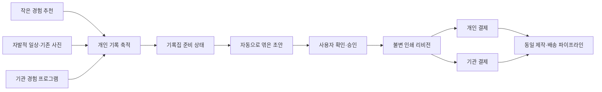

# Tuti 핵심 BM 서비스 적용·검증 계획

작성일: 2026-09-10
문서 상태: **팀이 선택한 사업 방향을 서비스 실험과 구현 단위로 번역한 기준 문서**
검증 상태: 상품 규격, 가격, 구매전환율, 재구매율, 기관 계약성과는 아직 가설이다.

연결 문서:

- [현재 무료 디지털 기록집 구현](journal-books.md)
- [추천 이후 행동 루프](recommendation-action-loop.md)
- [Capacitor 공통 API 구조](capacitor-api-architecture.md)
- [관리자 콘솔](admin-console.md)

이 문서는 2026-09-10 팀 결정인 **개인 실물 미니 기록집**과 **기록집 연계 경험 프로그램**을 현재 구현의 다음 사업 검증 대상으로 삼는다. [이전 사업모델 논의](business-model-strategy.md)의 데이터 리포트 우선순위와 [이전 B2C 매출 시뮬레이션](b2c-revenue-simulation.md)의 5,900원 디지털 PDF 전제는 현재 실행 기준으로 사용하지 않는다.

## 1. 실행 결론

두 BM을 별도 제품으로 만들지 않는다. **하나의 기록집 생성·인쇄·주문 엔진을 만들고, 누가 비용을 부담하는지만 개인과 기관으로 나눈다.**

구현 순서는 다음과 같다.

1. 한 가지 실물 SKU의 인쇄 가능성과 실제 원가를 샘플로 확인한다.
2. 현재 무료 기록집에 자동 초안과 기록집 전용 퍼널 계측을 붙인다.
3. 정식 커머스 시스템 대신 안전한 최소 주문 장부와 호스팅 결제 링크로 첫 정상가 주문을 concierge 운영한다.
4. 수요 신호가 확인되면 먼저 20건까지 같은 방식으로 이행하고, 반복된 병목만 제품화해 최대 50건에서 배송 품질을 검증한다.
5. 같은 기록집 엔진으로 유료 기관 파일럿을 수행하고, 수익성과 업무 절감이 확인된 부분만 자동화한다.

기관 영업 인터뷰와 견적 검증은 개인 실험과 병행할 수 있다. 다만 **유료 계약 또는 착수금 전에는 기관 전용 포털을 개발하지 않는다.**

## 2. BM 범위와 제품 원칙

| 구분 | 판매하는 것 | 결제자 | 현재 판단 |
| --- | --- | --- | --- |
| 무료 핵심 경험 | 추천, 기록 작성·열람, 현재 제공 중인 기본 디지털 기록집과 PDF 보관 | 없음 | 이번 실험 동안 현재 동작을 유지해 실물 판매 때문에 기존 가치를 잠그지 않는다. PDF의 영구적인 가격 정책은 별도 제품 결정이다. |
| 핵심 BM ① | 사용자의 기록으로 이미 구성된 실물 미니 기록집 | 개인 | 가장 먼저 실제 정상가 주문과 주문별 수익성을 검증한다. |
| 핵심 BM ② | 경험 안내, 참가자 기록 수집, 개인별 기록집 제작·납품 | 기업·기관·프로그램 운영자 | 같은 기록집 제품을 쓰는 좁은 B2B2C 계약으로 검증한다. |
| 부가 수익 | 선택한 경험에 필요한 외부 예약·구매 연결 | 제휴 사업자 | 핵심 퍼널이 검증된 뒤, 추천 순위를 바꾸지 않는 범위에서만 붙인다. |

공통 원칙은 다음과 같다.

- 사용자가 더 많이 외출하거나 기록하도록 압박해서 구매를 만든다고 가정하지 않는다.
- 가입 직후 상품부터 홍보하지 않는다. 자신의 기록이 의미 있는 결과물로 보일 때 제안한다.
- 연령으로 구매 대상을 자동 분류하지 않는다. 기록량, 사진·글 구성, 사용 맥락과 실제 행동으로 본다.
- 사용자가 쓰지 않은 감정, 관계, 삶의 의미를 AI나 규칙으로 만들어 넣지 않는다.
- 자유 편집 도구보다 **먼저 완성된 초안과 적은 결정**을 제공한다.
- 개인 기록과 사진은 기본 비공개다. 기관이 비용을 내도 참가자 원문 열람권을 자동으로 얻지 않는다.
- 무료, 할인, 선물, 기관 지원 주문을 정상가격 본인 구매와 분리해 집계한다.

초기 범위에서 제외한다.

- 월간 자동 구매와 기록집 구독
- 고급 디지털 기록집 유료화
- 스티커·자유 배치를 포함한 범용 포토북 편집기
- 커플·가족 공동 편집과 복잡한 권한 체계
- 기관별 전용 앱과 고객별 코드 분기
- 관광객 모집, 신규 방문 보장, 광고 대행, GPS·QR 방문 인증, 상권·관광 성과 분석
- 직접 예약·취소·정산과 추천 순위 판매
- 다수 판형·제본·종이 옵션
- 추천 API 판매, 핵심 추천 유료 구독, Tuti Pass와 일반 광고 판매

예약·구매 제휴는 이 문서의 첫 구현 범위가 아니다. 이후 붙이더라도 클릭이나 예약 접수를 매출로 보지 않고 **취소되지 않은 실제 이용 완료 뒤 정산이 확정된 건**만 제휴 수익으로 인정한다.

## 3. 검증할 가설과 구분할 결과

### 핵심 가설

| ID | 가설 | 이를 뒷받침하는 실제 증거 |
| --- | --- | --- |
| H1 | 별도 독촉 없이 실물로 엮을 만큼 기록이 쌓인다. | 첫 기록 이후 90일·180일 내 `book-ready` 도달률 |
| H2 | 자신의 기록으로 이미 만든 초안이 적은 수정만으로도 구매할 만한 결과가 된다. | 자동 초안 열람, 마지막 페이지 도달, 수정시간, 정상가 결제. 자동 초안과 기존 선택 시작의 우열은 이후 비교실험으로 별도 확인 |
| H3 | Tuti 핵심 사용자 중 자기 돈으로 기록집을 사는 집단이 존재한다. | 서비스 활성·기록 준비 상태별 정상가 본인 구매율 |
| H4 | 작은 기록도 인위적인 채움 없이 실물 한 권으로 만족스럽다. | 희소 기록 샘플의 승인, 배송 후 만족, 재제작·환불 이유 |
| H5 | 구매하지 않는 이용자까지 포함해도 기록집 코호트가 지속 가능한 기여를 만든다. | 주문별 CM1·CM2뿐 아니라 코호트 전체의 무료 추천·저장비, 획득비와 배분 고정비를 뺀 잔여액 |
| H6 | 첫 책 이후 자연스러운 두 번째 구매 계기가 생긴다. | 180일 정상가 재구매율, 구매 간격과 계기 |
| H7 | 기관은 인쇄물이 아니라 개인별 수집·정리 업무 절감에 비용을 낸다. | 유료 계약, 운영자 절감시간, 계약 CM2 |
| H8 | 기관 상품을 고객별 SI 없이 반복 판매할 수 있다. | 두 번째 기관의 공통 기능 재사용률과 비표준 작업시간 |

### 반드시 따로 보는 축

한 숫자로 합치면 BM을 잘못 판단하게 되는 항목이다.

| 축 | 구분 |
| --- | --- |
| 수령 관계 | `self` 본인 소장 / `gift` 다른 사람에게 선물 |
| 구매 계기 | `none` / `anniversary` 기념일 / `transition` 시기 마무리 / `season` 계절 / `program_end` 프로그램 종료 / `other` |
| 기록 원천 | `tuti_accumulated` 제안 전에 Tuti 안에 축적 / `imported_for_book` 책을 만들며 기존 자료를 가져옴 / `mixed` 혼합 / `unknown` |
| 추천 연계 | 책에 포함된 기록 중 유효한 추천 실행과 연결된 기록 수·비율. 앱 안에 미리 쌓였다는 사실과 별도 축 |
| 결제자 | `individual` 개인 / `organization` 기관 |
| 가격 성격 | 정상가격 / 할인 / 무료 샘플 / 기관 전액 지원 |
| 역할 | 기록 주인 / 편집자 / 결제자 / 수령인 |

기관이 100권을 주문해도 개인 구매자 100명으로 세지 않는다. 같은 사람이 선물용 두 권을 사도 재구매 고객 두 명으로 세지 않는다. 제안 전에 Tuti에 수동으로 올린 기존 사진은 `tuti_accumulated`일 수 있지만 추천 루프 성과는 아니므로 추천 연계 비율을 따로 본다. 기존 사진만으로 만든 주문은 매출에는 포함하되 추천→경험→기록 루프의 성과에는 포함하지 않는다. 수령 관계, 구매 계기, 결제자와 프로그램 참여는 서로 독립된 값으로 저장해 “졸업 선물”이나 “기관이 지원한 본인 소장”도 잃지 않는다.

## 4. 현재 구현과 목표 사이의 차이

### 재사용할 기반

| 현재 기반 | 확인한 구현 | 적용 방향 |
| --- | --- | --- |
| 기록 작성 | [JournalEditorScreen](../src/features/tuti/screens/journal/JournalEditorScreen.tsx)에서 사진 한 장, 짧은 글, 날짜와 장소를 저장하고 기존 사진의 촬영일도 읽을 수 있다. | 가벼운 기록 입력은 유지한다. 일괄 가져오기는 수요가 확인된 뒤 별도 실험한다. |
| 추천과 기록 연결 | [JournalCreateFlow](../src/features/tuti/flows/JournalCreateFlow.tsx)이 추천 실행 ID와 생성 기록 ID를 행동 이벤트로 연결한다. | 새 기록에는 원천과 추천 실행 관계를 영속적으로 남겨 책 단위 원천을 계산한다. |
| 무료 기록집 | [JournalBookFlow](../src/features/tuti/flows/JournalBookFlow.tsx)에 1~12개 선택, 제목·편지·표지, 전체 미리보기, 완성·재열람·삭제가 있다. | 무료 디지털 흐름과 사용자 소유권은 유지하고 자동 초안·인쇄 주문을 옆에 붙인다. |
| PDF 생성 | [기록집 렌더러](../src/server/pdf/journalBook.tsx)가 서버에서 A5 PDF를 만든다. | 디지털 렌더러는 유지하고 공급사 사양에 맞는 별도 인쇄 렌더러를 둔다. |
| 비공개 보관 | [기록집 저장](../src/server/journal/bookStorage.ts)이 소유자별 비공개 객체를 보관한다. | 인쇄 proof와 최종 원본도 종류·버전·해시를 분리해 비공개 저장한다. |
| 인증·공용 API | 웹과 Capacitor가 같은 Bearer 세션과 원격 API를 사용한다. | 주문 API도 같은 경계를 쓰되 결제 전에는 복구 가능한 계정 연결을 요구한다. |
| 관리자 기반 | [AdminScreen](../src/features/admin/AdminScreen.tsx)에 내부 운영, 활동, 문의, 로그가 있다. | 내부 주문 큐와 BM 퍼널을 별도 탭으로 추가한다. 기관 담당자에게 이 화면을 주지 않는다. |

### 바로 유료화할 수 없는 이유

| 차이 | 현재 상태 | 필요한 결정·구현 |
| --- | --- | --- |
| 구매 경험 | 사용자가 첫 단계부터 기록을 직접 고른다. | 적격 사용자에게 먼저 자동 초안을 보여주고 빼기·교체·순서·제목·표지만 고치게 한다. |
| 판형 | 현재 PDF는 A5, 페이지 수는 내용에 따라 달라진다. | 약 15×15㎝·24페이지 가설을 실제 공급사 재단·도련·페이지 규칙으로 확정한다. |
| 사진 수 | 현재 기록당 사진 한 장, 한 권 최대 12개다. | 사진 12~18장 가설과 6~10개 기록을 한 SKU에 담을 레이아웃을 샘플로 먼저 결정한다. |
| 이미지 품질 | 클라이언트 [crop 출력](../src/features/tuti/components/ImageCropDialog.tsx)부터 약 1200px이고 서버도 [최대 1200×900 WebP](../src/server/journal/imageStorage.ts)로 축소한다. | 현재 파일을 인쇄 원본으로 가정하지 않는다. 샘플에서 부족한 경우 선택된 사진만 별도 private upload로 다시 받아 인쇄용 자산으로 보관한다. |
| 인쇄 원본 | 도련, 안전영역, 표지 앞·뒤·책등, 공급사 색상·폰트 규칙이 없다. | 공급사 사양별 preflight와 `renderVersion`을 가진 불변 인쇄 리비전을 만든다. |
| 서버 신뢰 경계 | [완성 API](../src/app/api/journal-books/route.ts)는 PDF를 다시 만들지만 `pageCount`는 클라이언트 값을 받는다. | 인쇄 페이지 수, SKU, 가격, 할인, 배송비는 모두 서버가 계산하고 고정한다. |
| 작업 처리 | 현재 완성 작업의 동시성 제어는 서버 프로세스의 `creating` 불리언이다. | 결제·일괄 제작에는 DB 기반 작업 상태, 멱등 키, 재시도와 실패 격리가 필요하다. |
| 거래 | 상품, 가격, 주문, 결제, 주소, 제작, 배송, 환불, 재제작 모델이 없다. | 무료 `JournalBook`과 분리된 거래·이행 도메인을 추가한다. |
| 측정 | [제품 활동 이벤트 계약](../src/shared/api/productActivity.ts)과 [ProductActivityEvent 모델](../prisma/schema.prisma)은 세션별 행동 한 번만 저장하며 기록집 이벤트가 없다. | 반복 가능한 기록집 퍼널 이벤트와 서버 주문 상태를 별도로 둔다. |
| 계정 병합 | 현재 [이메일](../src/server/auth/emailCode.ts)·[소셜](../src/server/auth/oauth.ts)의 일부 익명 병합 경로는 기록만 옮기며 무료 `JournalBook`이 원 사용자 삭제와 함께 사라질 수 있다. | Gate 1 전에 서버 객체는 한 트랜잭션으로 이전하고, 성공 뒤 로컬 초안을 재연결하며 project·variant 충돌 규칙을 둔다. |
| 장기 관찰 | 현재 일반 제품 활동 이벤트는 [보존 작업](../src/server/auth/retention.ts) 뒤 삭제되며 BM의 180·365일 코호트 원본이 없다. | 콘텐츠 없는 최소 기록집 이벤트와 버전된 코호트 집계의 보존·익명화·삭제 정책을 관찰창보다 먼저 확정한다. |
| 기관 | 조직, 프로그램, 참가, 기관 권한과 지원 주문이 없다. | 첫 유료 계약의 공통 요구만 프로그램 도메인으로 만든다. |

가장 큰 제품 차이는 결제 버튼이 아니다. 현재 흐름은 사용자가 책을 만들기로 한 뒤 편집을 시작하지만, 검증하려는 가치는 **사용자가 별도 정리를 시작하기 전에 이미 자신의 책처럼 보이는 결과물을 만나는 것**이다.

## 5. 공통 제품 구조

### 기록집 준비 상태

`book-ready`는 연령이나 사용자가 쓴 감정으로 판정하지 않는다. 현재 SKU의 인쇄 레이아웃이 빈 페이지를 억지로 채우지 않고 완성될 수 있는지만 서버 규칙으로 판단한다.

샘플 전 후보 집계에는 `기록 6개 이상 + 사진이 있는 기록 4개 이상` 같은 임시 조건을 사용할 수 있지만 이를 실물 `book-ready`로 부르지는 않는다. 목표 상품 가설은 사진 12~18장인데 현재 구조는 기록당 사진 한 장·권당 최대 12개이므로 두 조건이 맞지 않는다. Gate 0에서 다음 중 하나를 명시적으로 선택한 뒤 실제 레이아웃이 완성되는 조건을 `book-ready-v1`로 고정한다.

- 목표 사진 수를 낮추고 적은 장면에 맞는 판형·페이지를 택한다.
- 한 기록 또는 책 리비전에 여러 사진을 담게 한다.
- 기록집 최소 기록·사진 기준을 올린다.

기간 조건, 최소 글자 수, 사진 비율도 상품 품질에 꼭 필요한 만큼만 사용하며 운영 설정으로 버전 관리한다.

- `not_ready`: 상품 제안을 노출하지 않는다.
- `near_ready`: 디지털 기록집은 쓸 수 있지만 실물 구매를 위해 더 기록하라는 진행률·압박 문구는 보여주지 않는다.
- `ready`: 기록 화면에 한 번의 차분한 제안을 표시한다.
- `dismissed`: 사용자가 닫으면 정한 기간 동안 다시 노출하지 않는다.

준비 상태 도달과 실제 제안 노출은 구분한다. 백그라운드 집계로 준비됐다는 이유만으로 `offer exposed` 분모에 포함하지 않는다.

### 자동 초안

자동 초안은 다음 원칙으로 만든다.

1. 최근 기간 또는 사용자가 고른 기간에서 인쇄 가능한 기록 수를 규칙으로 선택한다.
2. 사진이 있는 기록과 글만 있는 기록이 모두 자연스럽게 보이는 검증된 레이아웃을 사용한다.
3. 날짜순을 기본으로 하되 사용자가 기록을 빼거나 교체하고 단순 순서를 바꿀 수 있게 한다.
4. 제목은 날짜·계절처럼 확인 가능한 정보만 사용한다. 감정·관계·서사는 만들지 않는다.
5. 사용자가 명시적으로 미리보기를 열 때 생성한다. 모든 적격 사용자의 전체 PDF를 미리 렌더링하지 않는다.
6. 책 안에서 바꾼 제목·본문·사진 선택은 원본 `JournalEntry`를 수정하지 않는 book-only override로 저장한다.

자유 배치, 스티커, 수십 개 표지 테마는 만들지 않는다. 사용자가 원하는 것은 직접 꾸미는 즐거움이라는 결과가 우세하면 그 고객군은 초기 Tuti 대상이 아닌 것으로 본다.

### 불변 인쇄 리비전

사용자가 proof를 승인하면 다음을 함께 고정한다.

- 기록별 표시 내용과 순서
- 표지·첫 장 글·레이아웃과 템플릿 버전
- SKU, 판형, 페이지 수와 공급사 규격 버전
- 사용한 이미지 자산 버전
- proof 객체 키·SHA-256과 content fingerprint
- 사용자가 승인한 시각

승인 뒤 이 잠긴 내용에서 print master를 생성해 preflight를 통과하면 master 객체 키·SHA-256을 별도 산출물 이력으로 기록한다. 성공한 master가 생기기 전에는 주문·checkout을 열지 않는다. 결제 이후 원본 기록이 수정·삭제돼도 주문 산출물이 바뀌면 안 된다. 디지털 기록집 삭제와 거래에 필요한 주문 산출물 보존도 분리한다. 계정 삭제 중 제작 중인 주문과 법적으로 보존해야 하는 거래자료를 어떻게 처리할지는 출시 전에 정책과 코드로 함께 정한다.

## 6. 개인용 MVP 사용자 흐름

### 1. 기록 축적

추천 후 남긴 기록과 자발적으로 남긴 일상 기록을 모두 사용할 수 있게 한다. 현재 한 장씩 기존 사진을 선택하는 흐름은 첫 파일럿에 활용할 수 있다. 다만 기록에 생성 맥락과 선택적인 `recommendationRunId`를 남겨 추천 연계, 일반 기록, 프로그램 기록, 책 제작 중 가져오기를 구분한다. FK를 저장할 때 해당 추천 실행이 실제로 존재하고 같은 기록 소유자의 것인지 검증한다. 책 단위에서는 제안 전에 이미 Tuti에 있던 기록과 책을 만들며 가져온 자료의 비율을 계산한다.

일괄 사진 가져오기는 첫 주문까지 걸리는 시간을 줄일 수 있지만 핵심 루프와 다른 가설이다. 초기 모집에서 기록이 부족해 실험 자체가 불가능할 때만 가벼운 일괄 가져오기를 다음 작업으로 올린다.

고해상도 원본도 모든 무료 기록에 미리 보관하지 않는다. 실물 샘플에서 현재 자산이 부족하다고 확인된 페이지만 사용자가 원본을 다시 선택하게 하고, 그 파일은 승인 리비전과 주문에만 연결해 별도 보존·삭제 정책을 적용한다.

### 2. 준비된 기록집 제안

`/journal`의 기존 기록집 진입 카드와 완성본 화면에서 다음 정보를 보여준다.

- 자신의 기록으로 만든 대표 표지 또는 기록 기간
- “이미 남긴 시간으로 한 권을 준비했어요”와 같은 비압박 문구
- 실물 규격, 페이지 수, 배송비 포함 최종가격
- 제안을 닫거나 한동안 보지 않을 선택

가입 직후, 기록이 없는 상태, 디지털 보관만 원한다고 답한 상태에는 반복 제안하지 않는다. 이사·졸업·기념일 같은 생활 사건은 기록 내용에서 추론하지 않고 사용자가 구매 목적에서 직접 선택하게 한다.

### 3. 초안 확인과 최소 수정

기존 `기록 선택 → 표지와 글 → 미리보기` 흐름을 `완성된 초안 → 필요한 부분만 수정 → 전체 proof 미리보기` 순서로 확장한다.

- 기록 빼기·교체와 단순 순서 변경
- 제목, 첫 장 글, 표지 선택
- 책에만 적용되는 짧은 글 수정
- 인쇄 안전영역과 실제 페이지 전체 proof
- 글자가 작거나 사진 품질이 부족한 페이지의 구체적인 경고

가독성은 별도 고령자 전용 상품을 만들기 전에 기본 SKU가 충분한 본문 크기와 여백을 갖추는 방식으로 해결한다. 희소 기록, 긴 글, 반복된 산책 사진, 큰 글씨가 필요한 구성으로 실물 샘플을 각각 확인한다.

### 4. 상품 확인과 결제

결제 전에 한 화면에서 다음을 확인할 수 있어야 한다.

- SKU와 실제 크기, 제본·종이의 핵심 정보
- 책 수량과 배송비를 포함한 최종 결제금액
- 예상 제작·출고·도착 범위
- 주문 확정 뒤 수정 가능 시점
- 취소, 환불, 불량·오배송 재제작 기준
- 본인 소장 또는 선물 목적

사용자는 이 견적과 배송조건을 본 뒤 “이 내용과 금액으로 제작”을 승인한다. 이 동작이 proof와 content fingerprint를 잠근다. 서버가 같은 fingerprint로 print master를 만들고 preflight와 hash 기록을 성공한 뒤에만 주문과 checkout을 만든다. 따라서 공통 순서는 `proof 미리보기 → 견적 → proof 승인·잠금 → print master·preflight → 주문 → 결제`다.

현재 익명 세션도 기록집을 만들 수 있지만 주문 전에는 이메일 등 복구 가능한 계정 연결을 요구한다. 로그인 과정에서 현재 기록과 초안이 안전하게 합쳐지는지 확인한 뒤 checkout을 재개한다.

P7의 성인 자녀 선물처럼 기록 주인과 편집·결제자가 다르면 콘텐츠 주인의 명시적 동의 뒤에만 proof를 잠근다. 첫 파일럿은 만료되는 확인 링크나 기록으로 남는 서면 동의를 운영자가 대조할 수 있고, 공동계정 기능으로 확대하지 않는다. 주문자가 직접 제공할 권한이 있는 사진·글만 올리는 일반 선물과, 다른 Tuti 계정의 비공개 기록을 가져오는 흐름은 구분한다.

카드 정보를 직접 저장하지 않고 호스팅 결제창을 우선 검토한다. Gate 1의 소수 주문은 서버가 만든 견적·주문 ID를 결제 링크 메타데이터와 연결하고 운영자가 정산 결과를 대조하는 최소 흐름으로 시작할 수 있다. 20건 이행에서 자동화 필요가 확인된 정식 흐름에서는 가격과 주문 상태를 서버 원본으로 두고, 결제 결과를 서명 검증한 webhook과 멱등 키로 반영한다. 앱 마켓 정책, 전자상거래 고지, 세무 처리는 실제 결제 수단을 정한 뒤 출시 게이트에서 다시 확인한다.

Capacitor 앱은 결제 전용 callback 경로와 핸들러를 추가해 인앱 브라우저를 닫고 해당 주문 상태를 다시 조회한다. callback URL의 성공 파라미터는 결제 증거로 믿지 않으며, Gate 1에서는 운영자 대조, 제품화 뒤에는 검증된 webhook 결과만 주문 성공으로 표시한다.

### 5. 제작과 배송

첫 유료 배치에서는 공급사 API를 만들지 않고 내부 관리자가 검수·발주하는 concierge 운영을 허용한다.

1. 결제 성공과 승인된 인쇄 리비전을 확인한다.
2. 자동 preflight 결과와 경고를 검수한다.
3. 공급사에 수동 발주하고 외부 주문번호·실제 원가·작업시간을 기록한다.
4. 송장을 등록하고 이메일로 상태를 보낸다. 현재 메일 코드는 OTP 전용이므로 첫 20건은 승인된 운영 템플릿으로 수동 발송하고, 반복 필요가 확인되면 범용 거래 메일·발송 로그·재시도를 만든다. 푸시는 주문상태용 별도 opt-in, 기기 등록 조건과 payload를 구현한 뒤에만 보조 채널로 쓴다.
5. 배송 완료 뒤 한 번의 만족·불량 확인을 받는다.
6. 취소·환불·재제작은 사유와 실제 비용을 별도 상태로 남긴다.

배송지는 주문·이행 데이터에만 보관하고 분석 이벤트에 복사하지 않는다. 주소·연락처의 접근자, 암호화, 마스킹, 삭제 시점과 공급사 전달 기록을 출시 전 정한다.

### 6. 두 번째 구매

매월 새 책을 자동 제안하지 않는다. 마지막 주문 이후 새 기록이 다시 한 권을 이룰 때, 계절 변경이나 사용자가 직접 고른 기념일에만 제한적으로 제안한다. 첫 책 만족이나 재구매 의향이 아니라 **두 번째 정상가 결제**를 반복 수요로 본다.

## 7. 페르소나별 적용 시나리오

페르소나는 UI 분기용 인구통계가 아니라 실패 조건을 빠뜨리지 않기 위한 테스트 케이스다.

| 페르소나와 시나리오 | 제안 시점·구현 | 관찰할 증거 | 하지 않을 대응 |
| --- | --- | --- | --- |
| P1 30세 직장인: 기록이 쌓임 / 가입 직후 | 두세 달 기록으로 자동 초안을 보여준다. 신규 상태에는 기록집을 전면 홍보하지 않는다. | 초안 끝까지 보기, 수정시간, 본인 정상가 주문 | 기록을 더 남기라는 연속 알림 |
| P2 28세 구직·이직 준비자: 디지털로 충분 / 시기 마무리 | 준비된 책에는 부담 없이 접근할 수 있게 하고 오래된 기록을 다시 보는 순간에도 실물 선택지를 둔다. 계기는 주문 과정에서 선택적으로 묻는다. | 제안 닫기, 이후 자발적 재진입과 정상가 주문 | 생활 변화를 내용에서 추론하거나 할인만으로 구매 유도 |
| P3 33세 커플: 기념일 선물 / 월간 제안 | 선물 배송지와 도착 예상일을 지원하되 공동 편집 없이 한 명이 완성한다. | `gift` 주문, 납기 중요도, 두 번째 실제 구매 시점 | 커플 앱 전환, 월간 구독 |
| P4 22세 대학생: 졸업·휴학 / 직접 꾸미기 선호 | 최종가격을 처음부터 보여주고 기간 마무리형 단품을 검증한다. | 가격 이탈과 자동 완성 선호 여부 | 자유 편집기 확장으로 모든 포토북 고객 공략 |
| P5 39세 부모: 자신의 시간 / 기존 육아앨범 | 아이 성장앨범 대체가 아니라 본인 관점의 작은 외출을 담는다. | 기존 서비스에 없는 기록인지, 추가 입력시간 | 육아 시장 전용 기능과 대량 사진 이전 |
| P6 47세 산책 사용자: 계절 변화 / 운동 수치 중심 | 같은 길의 시간 변화를 날짜순·계절 단위로 보여준다. | 반복 장면의 소장 가치와 본인 구매 | 걷기 데이터 리포트 상품으로 확대 |
| P7 64세 취미 기록자: 직접 구매 / 자녀 선물 | 기본 SKU의 글자 크기와 사진 밀도를 실물로 확인하고 선물 목적을 구분한다. | proof 승인, 수령 후 가독성, 실제 결제자 | 초기부터 가족 공동계정과 여러 판형 제공 |
| P8 문화 프로그램 운영자: 6주·30명 / 저가 300명 행사 | 개인별 수집·편집을 줄이는 다회차 프로그램만 견적 낸다. | 참가율, 운영자 전후 작업시간, 계약 CM2 | 1인당 저가 당일 배포물 수주 |
| P9 관광 프로그램 담당자: 모집된 체류 프로그램 / 신규 방문 보장 | 이미 확보된 참가자의 경험 기록과 결과물로 범위를 고정한다. | 유료 계약, 개인 proof 승인, 표준 기능 재사용 | 관광객 모집·방문 인증·성과 보장 |

우선순위는 P1·P6의 본인 소장, P2·P3·P4·P7의 명확한 마무리·선물 계기, P8·P9의 표준 기관 프로그램 순이다. 단, 이 순서는 인터뷰 대상과 실험 배치를 정하기 위한 가설이며 시장 규모 순위가 아니다.

## 8. 기관용 MVP

### 첫 고객의 적격 조건

다음을 모두 만족하는 운영자를 먼저 찾는다.

- 참가자와 일정이 이미 정해져 있다.
- 여러 회차에 걸쳐 개인별 사진·글이 생긴다.
- 종료 시 개인별 결과물을 제공할 예산이 있다.
- 현재 운영자가 참가자별 자료를 모으고 편집하는 일이 실제로 있다.
- 한 SKU, 제한된 브랜딩, 정해진 수정 횟수와 마감을 받아들인다.
- 신규 방문객 수나 정밀 방문 인증을 Tuti에 요구하지 않는다.

첫 파일럿은 운영과 동의가 단순한 성인 20~40명의 4~6주 프로그램을 권한다. 이는 원문에서 확인된 시장 결론이 아니라 운영 복잡도를 낮추기 위한 **잠정 작업 범위**다. 아동·청소년 프로그램은 보호자 동의와 기관별 책임 범위를 정리한 뒤 별도 단계에서 검토한다.

### 참가자 흐름

1. 내부 관리자가 계약 범위에 맞춰 프로그램 기간, 공통 안내, 기록 질문과 제한된 표지를 설정한다.
2. 참가자는 만료일이 있는 초대 링크나 코드로 참여하고, 자신의 계정과 프로그램 참여를 명시적으로 연결한다.
3. 참가자는 매 회차 자신의 비공개 공간에 사진과 짧은 글을 남긴다.
4. 프로그램 종료 전에 개인별 자동 초안을 확인하고 직접 수정·제작 승인한다.
5. 승인한 참가자의 불변 인쇄 리비전만 기관 지원 주문에 포함한다.
6. 첫 운영안의 기본 납품은 기관 한 곳으로 일괄 배송한다. 이 역시 검증 편의를 위한 잠정 범위이며, 개별 배송은 주소 처리와 비용이 별도 합의된 경우만 제공한다.

참가자가 기록하지 않으면 운영자가 대신 입력하는 것을 기본 서비스로 삼지 않는다. 미참여가 많아 운영자의 일이 오히려 늘면 BM 가설이 실패한 것이다.

첫 파일럿의 경험 안내는 운영자가 이미 정한 회차·장소·활동을 Tuti가 같은 형식으로 보여주는 범위로 시작한다. 현재 공통 추천 엔진으로 적합한 경험을 제안할 수 있는 프로그램이라면 선택 기능으로 연결하되, 기관별 추천 알고리즘·장소 데이터 구축은 계약 기본 범위에 넣지 않는다. 이로써 “경험 안내 + 기록 수집 + 기록집”이라는 상품은 유지하면서 관광객 모집 사업으로 넓어지는 것을 막는다. 결과 보고에서는 `운영자 제공 경험 안내`, `Tuti 공통 추천`, `기록 수집`, `개인별 제작` 중 실제 제공한 구성만 검증됐다고 표시한다.

### 기관 담당자 화면

Tuti 전체 `/admin`을 기관에 재사용하거나 노출하지 않는다. 첫 유료 파일럿은 내부 운영 화면에서 집계한 정기 리포트를 전달해도 된다. 두 번째 독립 고객도 같은 실시간 기능을 요구할 때에만 기관 범위가 강제된 별도 권한과 화면을 만들며, 제공한다면 다음 정보로 제한한다.

- 초대 수, 참여 수, 회차별 기록 제출 여부·개수
- 기록집 준비, proof 승인, 제작 포함 여부
- 마감과 배송 예외
- 계약에서 합의한 집계

개별 사진, 제목, 본문, 위치 원문은 기본적으로 보여주지 않는다. 기관 로고·문구도 제한된 표지 영역에만 넣어 개인 책이 홍보책자로 바뀌지 않게 한다. 후기로 쓰려면 기록집 제작 동의와 별도의 선택 동의를 받는다.

### 계약과 가격 구조

견적은 다음 세 항목을 분리한다.

- 프로그램 설정·운영비
- 실제 승인·제작하는 기록집 권당 비용
- 사전에 합의한 개별 배송, 추가 수정 등 추가 작업비

계약별로 회의, 설정, 검수, 수정, CS, 발주 시간을 기록한다. 권수가 많다는 이유만으로 수익성이 있다고 판단하지 않는다.

## 9. 권장 도메인 모델과 API 경계

아래 이름은 Gate 1 이후 실제 이행 병목에 맞춰 순차 제품화할 **목표 구조**의 제안이며, 핵심은 이름보다 불변성과 접근 경계다. 첫 수요 실험과 20건 이행 학습에서는 승인 리비전, 주문 ID, 결제 대조, 배송지 접근 통제와 감사 이력에 필요한 최소 부분만 구현한다.

| 모델 | 역할과 필수 정보 |
| --- | --- |
| `JournalEntry.creationMethod` | 주 생성 경로인 `recommendation`, `manual`, `book_import`, `unknown`. `recommendationRunId`와 `programParticipantId`는 별도 nullable 관계로 두어 추천과 프로그램이 동시에 해당할 수 있게 한다. 책에서는 생성시각과 제안시각까지 사용해 `tuti_accumulated/imported_for_book/mixed`를 계산한다. |
| `JournalBookProject` | 실물 책 한 권의 논리적 aggregate. 소유자, 선택 기간, 생성 offer와 현재 draft revision을 묶는다. 이벤트의 `bookId`는 기존 무료 `JournalBook.id`가 아니라 이 project ID다. |
| `JournalBookOffer` | 적격 규칙·상품·가격·실험 버전, 실제 노출·닫기 시각. 제안 분모의 원본이다. |
| `ExperimentAssignment` | 사용자·실험 키별 고정 variant, 최초 배정·노출과 분석 제외 여부. 익명 계정 병합 후에도 한 배정만 남긴다. |
| `JournalBookRevision` | 서버에 저장한 초안, 기록별 순서와 book-only override, `draft/locked` 상태와 승인 시각. |
| `JournalBookSourceAsset` | 인쇄에 다시 선택한 비공개 원본 이미지. MIME·byte·pixel 크기, EXIF 제거 상태, SHA-256, crop transform, revision·페이지 연결과 보존기한을 둔다. |
| `JournalBookAsset` | 렌더 출력인 `digital_preview`, `digital_final`, `print_proof`, `print_master` 구분, 객체 키, 크기, 페이지 수, content fingerprint·해시, 렌더러·공급사 규격 버전. |
| `JournalBookOrder` | 주문 header. 개인 또는 기관 결제자, 통화, SKU·가격·할인·배송비 스냅샷과 멱등 키를 둔다. |
| `JournalBookOrderItem` | 주문별 한 개 이상의 리비전, 콘텐츠 소유자, 선택적인 프로그램 참가 관계, 수량, 수령 관계와 배송 묶음을 둔다. 개인 주문은 보통 1개, 기관 일괄 주문은 참가자별 여러 item이다. |
| `BookPaymentAttempt`, `PaymentWebhookReceipt`, `BookRefund` | 결제 시도, 고유 공급자 event 수신·검증, 부분·전체 환불을 각각 1:N 이력으로 둔다. 금액과 통화, 주문 일치 여부, 제한된 payload hash를 보관하고 카드 원문은 저장하지 않는다. |
| `BookProduction`, `BookShipment`, `BookReprint` | 인쇄 발주, 복수 배송, 부분 재제작을 독립 이력으로 둔다. 실제 변동비와 작업시간을 남기며 환불 상태를 중복 소유하지 않는다. |
| `JournalBookEvent` | UI 퍼널 이벤트. 사진·글·주소 없이 실험·상품·기록 구성과 맥락만 저장한다. |
| `RecommendationValueResponse` | 반복 계측 단계의 버전된 선택형 추천 만족·외출 도움 응답과 요청·응답 시각. 첫 파일럿의 접근 통제된 모집 설문을 제품화할 때 사용한다. |
| `Organization`, `ExperienceProgram` | 기관, 프로그램 기간·상태, 공통 설정, 계약·청구 참조. |
| `ProgramMembership`, `ProgramParticipant` | 기관 담당자 권한과 참가자 초대·동의·마감. 서로 다른 접근 경계를 갖는다. proof 승인 원본은 `JournalBookRevision` 하나이고 참가자 진행상태는 여기서 계산한다. |
| `ProgramRound`, `ProgramSubmission` | 회차별 경험 안내·기록 질문과 참가자 기록 연결. 회차 제출 여부를 원문 열람 없이 계산하고 `createdByRole`로 운영자 대리입력을 분리한다. |
| `JournalBookCohortAggregate` | 원시 이벤트 만료 전에 만드는 버전된 비콘텐츠 집계. 코호트·규칙·분모·기간과 익명화 상태를 남겨 180·365일 판정을 재현한다. |

결제, 환불, 인쇄와 배송 상태는 한 enum으로 합치지 않는다. 각 attempt·refund·production·shipment가 자신의 상태를 소유하고, 화면의 주문 상태는 이 원본들에서 계산한다. 모든 상태 변경은 허용된 이전 상태를 확인하고 이력을 남긴다.

현재 `JournalBook`과 A5 PDF는 기존 무료 완성본으로 그대로 읽을 수 있게 한다. 기존 행을 인쇄 가능 자산으로 소급 인정하지 않으며, 실물 주문을 시작한 책만 새 서버 리비전과 proof를 만든다. 서버 리비전이 생긴 뒤에는 서버가 초안의 권위 있는 원본이고 기기 저장본은 복구용 캐시로만 취급한다.

익명 사용자가 기존 이메일·소셜 계정에 연결될 때는 `JournalEntry`만 옮겨서는 안 된다. 서버의 기존 무료 `JournalBook`, 새 offer·project·revision·source/output asset·event·실험 배정을 대상 계정으로 한 트랜잭션 안에서 옮기고 중복 project·variant 충돌을 해결한 뒤 원 익명 사용자를 정리한다. 성공 응답 뒤 클라이언트의 로컬 draft도 대상 계정 리비전 또는 계정별 캐시로 다시 연결한다. 이 안전 병합이 Gate 1의 checkout보다 먼저다.

권장 API 경계는 다음과 같다.

| API | 서버 책임 |
| --- | --- |
| `GET /api/journal-books/readiness` | 현재 사용자와 SKU 버전으로 준비 상태를 계산한다. |
| `POST /api/journal-book-offers/[offerId]/exposure` | 화면 가시성 기준의 최초 실제 노출만 멱등 기록한다. 클릭으로 대신하지 않는다. |
| `POST /api/journal-book-offers/[offerId]/draft` | 사용자의 열기 동작을 기록하고 소유자 `JournalBookProject`와 첫 자동 초안을 만든다. |
| `POST/PATCH /api/journal-book-revisions` | 소유권을 확인해 초안·순서·override를 저장한다. |
| `POST /api/journal-book-revisions/[revisionId]/source-assets/upload-intent` | 선택 페이지만 private upload를 허용하고 만료시간, 크기·MIME·pixel 제한을 발급한다. |
| `POST /api/journal-book-revisions/[revisionId]/source-assets/[assetId]/complete` | 업로드 객체를 스트리밍 검증하고 EXIF를 제거한 뒤 hash와 crop·페이지 관계를 저장한다. |
| `POST /api/journal-book-revisions/[revisionId]/preview` | 공급사 규격 preflight와 content fingerprint를 가진 전체 proof를 만든다. |
| `POST /api/journal-book-orders/quote` | 현재 리비전을 검증해 서버 가격·배송·예상일과 만료되는 견적을 계산한다. |
| `POST /api/journal-book-revisions/[revisionId]/approve` | 견적 생성에 사용한 content fingerprint와 같은 proof를 잠그고 승인시각을 남긴다. |
| `POST /api/internal/journal-book-revisions/[revisionId]/print-master` | 잠긴 리비전과 proof fingerprint로 공급사 규격 master를 생성·preflight하고 hash를 고정한다. 파일럿은 동기·수동 실행, 이후 영속 작업으로 전환한다. |
| `POST /api/journal-book-orders` | 연결 계정, 잠긴 proof, 유효 견적, 같은 fingerprint의 preflight 성공 print master와 멱등 키를 확인해 결제대기 주문을 만든다. |
| `POST /api/journal-book-orders/[orderId]/payment-session` | 주문 금액·통화를 다시 확인하고 호스팅 checkout 세션을 만든다. |
| `POST /api/payments/.../webhook` | 공급자 서명·금액·주문을 검증하고 중복 없이 결제 상태를 바꾼다. |
| `GET /api/journal-book-orders/[orderId]` | 소유자에게 주문·배송 상태와 허용된 동작만 반환한다. |
| `POST /api/programs/[programId]/join` | 초대 만료·정원·참가 동의를 확인해 개인 참여를 만든다. |
| `GET /api/programs/[programId]/progress` | 기관 권한과 프로그램 범위를 강제해 집계 상태만 반환한다. |

표준 순서는 `미리보기 → 견적 확인 → proof·content fingerprint 승인·잠금 → print master 생성·preflight·hash 기록 → 결제대기 주문 → checkout 세션 → 결제 webhook → 제작`이다. 주문과 payment-session은 성공한 동일 fingerprint의 master가 여전히 존재하는지 모두 확인한다. 클라이언트가 보낸 `ownerId`, 가격, 페이지 수, 할인, 결제 성공, 기관 권한을 신뢰하지 않는다. 목표 구조의 인쇄 렌더링은 미리보기, proof와 master 모두 요청 프로세스의 메모리 잠금 대신 영속 작업 상태와 고유 작업 키로 중복을 막는다.

현재 API 클라이언트는 401 응답에서 익명 세션을 다시 만들 수 있으므로 “연결 계정 필요”를 일반 401로 표현하지 않는다. 안정된 오류 코드와 409 같은 별도 응답으로 로그인→익명 데이터 병합→checkout 재개를 명시한다. 이때 사용자별 로컬 초안 이전과 기록집 query 무효화도 함께 구현한다.

## 10. 이벤트와 지표

### 기록집 이벤트

`ProductActivityEvent`나 추천 실행용 `RecommendationAction`에 상거래 행동을 섞지 않는다. 반복 이벤트와 관련 객체를 담을 수 있는 별도 `JournalBookEvent`를 둔다.

| 이벤트 | 기록 주체 | 의미 |
| --- | --- | --- |
| `book_eligibility_reached` | 서버 | 특정 규칙·SKU로 처음 준비 상태가 됨. 파일럿은 인증 사용자가 `/journal` 또는 readiness API를 열 때 계산해 최초 도달을 upsert하고, 규모가 커질 때 배치 집계로 보완 |
| `book_offer_exposed` | 서버 확인을 동반한 클라이언트 | 사용자가 화면에서 제안을 실제로 봄 |
| `book_offer_dismissed` | 클라이언트 | 제안을 닫음. 선택형 이유만 받고 자유문은 기본 수집하지 않음 |
| `book_offer_opened` | 클라이언트 | 사용자가 제안을 눌러 개인 초안을 요청함 |
| `book_builder_started` | 클라이언트 | 무료 기록집 또는 실물 초안 제작 흐름에 진입함 |
| `book_auto_draft_viewed` | 클라이언트 | 자신의 내용이 들어간 첫 페이지를 봄 |
| `book_preview_rendered` | 서버 | proof 생성 성공 |
| `book_preview_engaged` | 클라이언트 | 마지막 페이지 도달 또는 명시적 전체 보기 완료 |
| `book_edit_saved` | 서버 | 최소 편집을 저장함. 변경 종류와 시간만 기록 |
| `print_asset_reselect_requested/completed` | 서버·클라이언트 | 인쇄 해상도가 부족한 선택 페이지만 원본 재선택을 요청·완료 |
| `book_quote_viewed` | 서버 확인을 동반한 클라이언트 | 최종가격과 배송조건을 실제로 봄 |
| `proof_approved` | 서버 | 사용자가 인쇄 내용을 잠금 |
| `print_master_rendered/preflight_passed` | 서버 | 승인 fingerprint로 master 생성·검사 성공. 주문 가능 조건 |
| `order_created` | 서버 | 멱등 주문 생성 성공 |
| `checkout_started` | 서버 | 결제대기 주문으로 호스팅 checkout을 시작함 |
| `payment_succeeded/failed/refunded` | 결제 webhook·관리 상태 | 실제 거래 결과 |
| `production_submitted` | 서버·관리자 상태 | 공급사 발주 완료 |
| `order_shipped/delivered` | 배송 연동·관리 상태 | 실제 이행 결과 |
| `reprint_requested/completed` | 서버·관리 상태 | 불량 대응과 실제 비용 |
| `feedback_requested/submitted` | 서버·클라이언트 | 배송 후 같은 대상에게 만족·불만을 요청·제출. 응답 수와 요청 분모를 함께 계산 |
| `reorder_started` | 서버 | 이전 구매자가 새 기록집의 결제를 시작함. 실제 반복 구매는 이후 `payment_succeeded`로 판정 |
| `book_purchase_declined` | 클라이언트 | 미리보기·견적·checkout 중단 뒤 선택적으로 이유를 남김 |

공통 속성은 `offerId`, project가 생긴 뒤의 `bookId`, 선택적인 `revisionId/orderId/programId`, `mode(digital/print)`, `eligibilityVersion`, `productVersion`, 기록 수·사진 수·기간 구간, 추천 실행과 연결된 기록 비율, 기록 원천, 수령 관계, 구매 계기, 결제자 유형, 가격 성격, 플랫폼, 실험 ID·variant다. 여기서 `bookId`는 실물 `JournalBookProject.id`다. concierge가 개입한 경우 `staffEditMinutes`, `staffReminderCount`, `createdByRole`도 별도 운영 로그에 남겨 자연 수요와 섞지 않는다. 사진, 본문, 제목, 정밀 위치, 이메일, 주소, 연락처를 이벤트에 넣지 않는다. 중단 이유는 `digital_enough`, `price`, `quality`, `delivery`, `wants_more_editing`, `not_now`, `other`, `prefer_not_to_say`처럼 제한하고 응답을 강제하지 않는다.

결제·배송·환불 지표는 클라이언트 이벤트가 아니라 주문·결제·이행 테이블을 원본으로 계산한다. `payment_succeeded`는 수요, `delivered`는 이행, 배송 뒤 사전 정의한 환불 관찰창까지 남은 순매출은 경제성의 증거로 서로 분리한다. 내부·QA 계정은 현재의 분석 제외 설정을 그대로 적용한다.

실험 variant는 클라이언트에서 매번 뽑지 않고 사용자·실험 키별로 고정한다. 최초 실제 노출시각, 사전에 정한 attribution window, 고유 사용자·고유 주문 분모, 환불 반영 시점을 이벤트 사전에 적는다. 익명 계정 병합과 중복 노출 뒤에도 한 사용자를 여러 variant로 세지 않는지 실험 전에 확인한다. 재설치 안정성은 연결 계정으로 다시 로그인한 경우만 보장할 수 있으며, 복구 불가능한 순수 익명 재설치는 새 분석 단위로 표시한다.

프로그램에는 `program_invite_viewed`, `program_joined`, `program_consent_completed`, `program_record_created`, `program_book_ready`, `program_proof_approved`, `program_book_delivered`를 같은 원칙으로 남긴다. 개인 원문 없이 초대→참여→기록→승인→납품의 이탈만 본다.

현재 관리자 활동의 `converted`는 기록 생성이나 추천 후 행동을 뜻하며 유료 구매가 아니다. BM 대시보드에서는 이 이름을 결제 전환으로 재사용하지 않고 `paid order`를 별도 지표로 표시한다.

### 서비스 이용자와 구매자의 겹침

“Tuti를 좋아한다”는 행동 로그 하나로 단정하지 않는다. 행동 지표와 별도의 선택형 만족 응답을 함께 본다. 첫 코호트의 잠정 행동 정의는 다음과 같다.

- `recommendation-active-30d-v1`: 제안 전 30일 안에 서로 다른 2일 이상 추천을 실행하고, 장소 선택·길찾기·복귀 확인 중 하나 이상 수행. 기록 수와 독립적으로 정의한다.
- `recommendation-completed-30d-v1`: 제안 전 30일 안에 추천 뒤 복귀 확인 또는 사용자의 실행 완료 응답이 있음. GPS 방문 증명으로 해석하지 않으며 “Tuti가 외출 결정에 도움 됐는지” 선택 응답을 별도로 본다.
- `record-active-30d-v1`: 제안 전 30일 안에 서로 다른 날의 기록을 두 번 이상 자발적으로 생성
- `book-ready-v1`: 샘플로 확정한 최소 기록·사진 조건을 만족
- `self-paid-buyer`: 최초 실제 제안 뒤 사전 등록한 구매 attribution window 안에 기관 지원·무료 샘플을 제외하고 본인 소장 정상가격 결제를 완료

| | 정상가 본인 구매 | 미구매 |
| --- | ---: | ---: |
| 추천 활성 + book-ready | 핵심 겹침 | 추천 가치는 있으나 상품 가치는 약한 집단 |
| 추천 비활성 + book-ready | 기록집 단독 구매 가능성 | 현재 전환 대상 밖 또는 이탈 집단 |

반드시 함께 보는 지표는 다음과 같다.

- 추천 활성자 중 `book-ready` 도달률
- 추천 활성·실행완료·ready 사용자와 각 비활성·미완료 ready 사용자의 정상가 구매율
- 정상가 구매자 중 추천 활성자 비율
- 추천 만족 응답과 구매 여부의 교차표. 행동만으로 “Tuti를 좋아한다”고 이름 붙이지 않음
- Tuti 축적, 외부 가져오기, 혼합 기록의 구매율과 책 안에서 추천 실행에 연결된 기록 비율
- 수령 관계, 구매 계기, 결제자별 주문과 고유 구매자 수
- 첫 기록부터 준비 상태·첫 결제까지 걸린 기간
- proof 수정 종류와 중앙 수정시간
- 취소·환불·재제작률과 이유
- 90일·180일 두 번째 정상가 구매율과 간격

첫 모집 때는 이벤트만으로 알 수 없는 `개인 기록 애착`, `과거 포토북·실물 기념품 구매`, `직접 편집할 시간·의욕`, `현재 대체 서비스`를 짧은 선택형 사전 질문으로 받는다. 이 응답을 모집 제외 조건으로 쓰지 않고 구매·비구매자의 특성을 비교하며, 자유서술은 필요한 인터뷰에서만 동의를 받고 수집한다.

추천 만족과 외출 도움 응답은 제안 전에 같은 버전의 선택형 문항으로 받는다. 첫 파일럿은 접근 통제된 모집 설문을 사용자 ID와 분리된 참여키로 연결할 수 있고, 반복 사용이 확인되면 `RecommendationValueResponse` 모델·API·UI로 옮긴다. 요청 대상·응답·미응답을 모두 세어 응답자 평균을 전체 만족으로 해석하지 않는다.

원시 `JournalBookEvent`의 보존기간은 가장 긴 365일 관찰창과 환불 반영기간을 충족하도록 개인정보 검토 뒤 정한다. 현재 일반 제품 이벤트의 짧은 보존정책을 그대로 상속하지 않는다. 원시 이벤트 만료 전 콘텐츠·연락처가 없는 버전된 코호트 집계를 만들고, purge job·계정 삭제 시 삭제 또는 비식별화 범위를 주문 법정보존 자료와 분리한다.

### 주문 수익성

예측과 관측을 섞지 않고 두 단계로 계산한다.

`예측 CM1 = 예상 정산매출 - 인쇄 - 포장 - 배송 - PG 수수료 - 재제작·환불 충당`

`관측 CM1 = 할인·환불을 반영한 실제 정산매출 - 실제 인쇄 - 포장 - 배송 - PG 수수료 - 실제 재제작 비용`

`예측/관측 CM2 = 해당 CM1 - 주문별 검수·문의·발주·재제작에 든 사람 시간비용`

관측 CM1에서는 이미 발생한 재제작 비용과 미래용 재제작 충당을 동시에 빼지 않는다.

기관 계약은 설정·운영 수수료를 수익에 더하고 영업·회의·설정·수정 시간을 모두 CM2에 포함한다. 매출의 간접세 포함 여부와 환불 반영 시점은 회계 기준을 하나로 고정해 이중 차감하지 않는다.

주문 단위가 양수여도 사업 전체는 적자일 수 있으므로 코호트 단위도 계산한다.

`코호트 잔여액 = 코호트 총 CM2 - 구매 여부와 무관한 추천·저장·미리보기 변동비 - 획득비 - 합의한 고정비 배부액`

`활성 사용자당 기대기여 = book-ready 도달률 × 제안 노출률 × 정상가 결제율 × CM2 - 활성 사용자당 무료 변동비`

## 11. 검증 실험과 단계 게이트

아래의 인원·주문 건수는 원문에서 입증된 시장 수치가 아니라 **학습 배치의 권장 기본안**이다. 24,900원은 공통 비교가격이고 7,000원·8,000원은 민감도 계산 예시였으므로 그대로 가격·마진 통과선으로 승격하지 않는다. 모집 전에 다음 판정표를 채워 소유자와 동결일을 남기고, 결과를 본 뒤 유리하게 바꾸지 않는다.

| 사전 결정 | 산정 근거 | 반드시 남길 것 |
| --- | --- | --- |
| SKU·정상가격 | 공급사 견적, 비교가격 조사, 목표 포지셔닝 | 세금·배송 포함 여부, 할인 정책, 승인자 |
| CM1·CM2 최소선 | 목표 이익과 예상 판매량, 팀 시간단가 | 계산식, 작업시간 범위, 원가 갱신일 |
| 개인 코호트 수와 판정 건수 | 확보 가능한 적격자 수와 다음 개발비 | 핵심·인접 모집 수, 독립 코호트 조건, 최소 노출·핵심 구매자 수, 재검증 상한 |
| 배송·불량 기준 | 공급사 SLA와 고객에게 약속할 범위 | 납기 기산점, 불량 정의, 환불 관찰창 |
| 운영시간 기준 | 팀이 월별 감당할 수 있는 주문량 | 주문당 p50·p90 상한, 시간단가 |
| 전환·획득 기준 | 관측 CM2와 사용자당 획득·제공비 | attribution window, 손익분기 전환율, CAC 범위 |
| 반복 구매 기준 | 관측 CM2, 획득비와 목표 LTV | 180일·365일 분모, 필요 재구매율, 동결일 |
| 기관 성과 기준 | 계약 전 운영자 baseline과 납품 약속 | 지표 분모, 목표값, 기관 확인, 측정 담당자 |

### Gate 0. 상품·공급 가능성

준비:

- 공급사 견적과 실제 파일 사양 확보
- 희소 기록, 표준 기록, 긴 글, 반복 산책, 큰 글씨의 **다섯 조건을 모두 덮는** 실물 샘플 제작. 한 샘플이 여러 조건을 겸할 수 있음
- 색상·크롭·글자·제본·배송 손상과 재제작 절차 확인
- 한 SKU의 정상가격과 실제 변동비 확정
- 현재 한 기록당 한 장인 사진 구조와 목표 사진 수의 충돌을 해결해 `book-ready-v1` 확정

통과 조건:

- 팀뿐 아니라 실제 목표 사용자 몇 명이 실물 샘플의 가독성, 사진 품질, 예상 크기와 proof 일치를 확인한다.
- 견적 원가와 예상 수동 작업시간으로 계산한 CM1·CM2가 사전 승인한 최소선보다 높다. 이 시점의 CM2는 아직 **추정치**다.
- 공급사가 1권 주문, 납기, 불량·재제작 조건을 실제로 제공한다.

통과하지 못하면 결제 개발 전에 판형, 페이지, 가격 또는 공급사를 바꾼다. 15×15㎝, 소프트커버, 약 24페이지, 배송비 포함 24,900원은 이 Gate에서 확정하거나 폐기할 비교 기준이지 출시 약속이 아니다.

### Gate 0.5-A. 적격·노출 계측 리허설

자동 초안을 개발하기 전에 테스트 계정으로 다음을 확인한다.

- readiness API가 `/journal` 방문 시 규칙 버전별 최초 도달을 멱등 upsert하고, 제안 노출은 실제 가시성 이후에만 별도로 기록한다.
- 실험 배정이 사용자별로 고정되고, 익명 계정 연결·연결계정 재로그인·중복 노출에도 분모가 늘지 않는다. 복구 불가능한 순수 익명 재설치는 새 분석 단위로 표시한다.
- 내부·QA 계정 제외, attribution window와 코호트 쿼리를 고정한다.
- 익명 계정 연결 뒤 readiness·실험 배정·초안 캐시가 한 사용자에게 귀속되는지 확인한다.

파일럿에서는 전체 사용자에 대한 과거 최초 readiness 시점을 정확히 재구성했다고 가정하지 않는다. 관찰 시작 전 이미 준비된 사람은 `preexisting_ready`로 표시하고, 자연 축적 코호트와 분리한다. 규모가 커져 실시간 방문 계산만으로 부족해질 때 배치 집계를 추가한다.

### Gate 0.5-B. 거래 E2E 안전 리허설

로드맵 단계 3의 최소 거래 흐름을 만든 뒤, 모집을 열기 전에 테스트 주문을 최소 두 분기로 통과시킨다.

- 정상 경로: `proof → 견적 → 승인 잠금 → print master·preflight → 주문 ID → 호스팅 결제 → 결제대조 → 수동 발주 → 배송`
- 취소 경로: `proof → 견적 → 승인 잠금 → print master·preflight → 주문 ID → 호스팅 결제 → 제작 전 취소 → 환불 → 장부 대조`

배송 뒤 불량·재제작·부분환불은 공급사 샘플 또는 별도 테스트 주문으로 검증한다.

- proof·견적·승인 fingerprint·print master hash·결제 금액·통화·리비전이 같은 주문 ID로 이어지는지 대조한다.
- 결제 공급자 원본과 주문 장부, 배송·환불 원본을 이벤트 집계와 맞춘다.
- 다른 계정의 기록·proof·주문·주소 접근 거부, 운영자 주소 마스킹과 접근 로그를 확인한다.
- 결제 복귀 실패, 중복 클릭, 동일 링크 재접속, 수동 상태 변경의 멱등성과 복구 절차를 확인한다.
- 환불 관찰창, 담당자, 사용자 안내 템플릿과 사고 대응 연락망을 고정한다.

### Gate 1. 개인 정상가 수요 신호

권장 첫 모집은 총 30~50명이며, 최소 두 집단을 사전에 나눈다.

- **핵심 코호트 20명 이상:** 제안 전에 Tuti에 쌓인 기록으로 `book-ready`인 사람. 추천 활성·비활성 사용자를 모두 포함하고, 각 책에서 추천 실행에 연결된 기록 비율을 별도로 계산한다.
- **인접 코호트 10~20명:** 추천 사용은 적지만 기존 사진, 선물 또는 시기 마무리 욕구가 있는 사람. 대량 가져오기 기능 대신 현재 입력 방식과 동일한 표준 concierge 안내로 참여시킬 수 있다.

가격에 민감한 사람, 디지털로 충분한 사람, 직접 꾸미기를 좋아하는 사람도 제외하지 않는다. 두 집단 모두 같은 SKU, 정상가격과 배송조건, 자신의 실제 초안을 보고 실제로 결제할 수 있어야 한다. 팀이 개별 초안을 대신 고치거나 개인별 독촉을 하지 않으며, 불가피한 개입은 작업시간·알림횟수·작성 주체를 남긴다.

이 Gate를 위해 먼저 필요한 것은 안전한 계정 연결, 자동 초안·proof, 필요한 원본 이미지 업로드, 승인 content fingerprint와 이후 생성한 공급사 규격 print master·preflight·hash의 연결, 서버 견적, 접근 통제된 최소 주문 장부, 호스팅 결제 링크·앱 복귀와 수동 발주다. print master 생성은 동기·관리자 실행이어도 되지만 실제 주문과 다른 리비전을 만들 수 없어야 한다. 범용 주문 관리자, 공급사 API, 영속 작업 큐와 완전한 webhook 자동화는 아직 전제하지 않는다.

수요는 주문 수가 아니라 **고유 정상가 결제자 수**로 판정한다. 한 사람이 여러 권을 사도 한 명이고, 할인·무료·기관 지원과 `assisted` 주문은 핵심 통과 건수에서 제외한다. 권장 기본 판정은 다음과 같으며 모집 전에 최종 동결한다.

- **advance:** 고유 정상가 결제자 5명 이상이며, 그중 무개입 `본인 소장 × Tuti에서 축적한 기록` 구매자가 3명 이상
- **reclassify:** 총 결제자는 5명 이상이지만 핵심 구매자가 3명 미만. 선물·가져오기 상품 가설은 남지만 Tuti 앱 내 축적 기록의 개인 소장 수요는 확인되지 않았으므로 핵심 배치를 멈추고 인접 BM으로 별도 결정
- **iterate once:** 총 결제자가 0~4명이고 비구매 인터뷰에서 해결 가능한 한 가지 마찰이 반복 확인됨. 결과물, 제안 시점, 편집 부담 중 그 변수만 바꾸고 사전 승인한 추가 표본 상한 안에서 한 번 재검증
- **pause:** 해결 가능한 공통 마찰이 없거나, 한 번의 재검증 뒤에도 `advance`를 충족하지 못함

호감 표현, 예약 의향, CTA 클릭, 팀 지인에게 준 무료 샘플은 결제로 인정하지 않는다. `payment_succeeded`가 수요 증거이고, 나중의 배송·환불 결과는 이행과 경제성 판정에 반영한다. 이 표본으로 시장 전체 전환율을 선언하지 않는다. 통과는 공개 출시가 아니라 Gate 2를 위해 **15~25명의 추가 정상가 구매자만 제한적으로 받을 권한**이다.

H2의 “적은 수정”은 수요와 별도 판정한다. 무개입 핵심 구매자의 편집시간 p50·p90, 교체한 페이지 비율, 원본 사진 재선택 요청→완료율과 그 단계 이탈을 본다. 팀이 약속할 수 있는 완료시간에서 역산한 사전선을 넘으면 자동 초안 편의 가설은 실패다. 이미 받은 주문은 이행하되, 신규 확대 전 자동 구성 또는 원본 재선택 흐름을 한 번 수정한다.

### Gate 1-A. 자연 기록 축적

기존 `book-ready` 사용자만 모집하면 “이미 준비된 초안이 팔리는가”는 알 수 있지만 H1은 검증할 수 없다. Gate 1과 동시에 첫 기록을 새로 남긴 전향적 코호트를 만들고, 실험을 위한 추가 기록 독촉 없이 90일·180일을 관찰한다.

- 최초 기록자 중 `book-ready-v1` 도달률과 도달시간
- 추천 활성·실행완료·비활성별 readiness와 정상가 본인 구매, 책 안의 추천 실행 연결 기록 비율
- 사용자당 무료 추천·저장·미리보기 비용을 반영한 `활성 사용자당 기대기여`
- eligibility 뒤 짧은 기간 실물 제안을 늦춘 동시 holdout 대비 추천·기록 재방문 변화. 표본이 작아 과거 사전기간만 쓸 경우 인과효과라고 표현하지 않음

필요 readiness 비율은 임의 고정값이 아니라 Gate 0의 **추정 CM2**와 활성 사용자당 비용에서 잠정 역산한다. Gate 2의 관측 CM2가 나오면 새 코호트부터 한 번 재산정하고, 기존 코호트를 새 SKU·readiness 버전으로 소급 재분류하지 않는다. 이 Gate가 성숙하기 전에는 자연스러운 `추천 → 경험 → 기록 → 구매` 루프가 검증됐다고 말하지 않는다. 트래픽이 충분해진 뒤 자동 초안 시작과 현재 기록 선택 시작을 무작위 비교하면 H2의 상대효과를 확인할 수 있지만, 첫 배치는 자동 초안 자체가 정상가 구매로 이어지는지부터 본다.

### Gate 2. 제작 이행

첫 20건 배송은 안정성 합격시험이 아니라 문제 유형을 찾는 학습 체크포인트다. 비율만 쓰지 않고 `정시 n/N`, `인쇄 불량 재제작 n/N`, `오배송 n/N`, `환불 n/N` 원건수를 함께 보고, 주문별 사람 작업시간은 p50과 p90을 모두 기록한다. 고객 변심·제작 전 취소와 인쇄 결함 재제작도 나눠 센다.

첫 20건에서 §11의 즉시 중단 사고가 없고, 정상가격과 현실적인 작업시간 개선 범위에서도 관측 CM2가 계속 음수가 되는 구조가 아니라면 필요한 안전 보강만 한 뒤 최대 50건까지 제한 배치를 늘린다. 50건에서는 다음을 사전 판정선과 비교한다.

- 공급사 SLA에서 가져온 정시 배송과 인쇄 결함 기준
- 팀 월간 수용량에서 역산한 주문당 작업시간 p50·p90
- 환불 관찰창이 지난 주문의 관측 CM1·CM2
- proof와 납품물 일치, 재제작 사유와 책임 주체

판정은 닫힌 분기로 남긴다.

- **advance:** 모든 사전 SLA·품질·작업시간·관측 CM2 기준을 충족하면 Gate 3으로 진행
- **iterate once:** 실패가 한 공급사, 한 템플릿 또는 한 운영 단계에 모이면 버전을 바꾸고 제한 배치를 한 번 더 검증. 이전 버전 결과와 합치지 않음
- **pause:** 즉시 중단 사고가 반복되거나, 현실적인 정상가격·운영 개선으로도 CM2와 품질 기준을 함께 맞출 수 없음

20건 전까지는 얇은 concierge를 유지하고, 20건에서 반복 확인된 병목과 안전 위험만 50건 배치 전에 제품화한다. 통과 전에는 공급사 API나 대규모 광고에 투자하지 않는다.

### Gate 3-O. 핵심 겹침과 유기적 확장 경제성

Gate 2 통과 뒤 판정한다. 서로 사용자가 겹치지 않고 모집 기간 또는 유입 채널이 다른 두 코호트와 최소 30명의 고유 정상가 첫 구매자는 방향을 확인하기 위한 학습 하한선일 뿐 통계적 확정치가 아니다. 각 코호트의 최소 제안 노출 수, 핵심 구매자 수·비율과 허용 불확실성은 모집 전에 정한다. 합산값으로 한 코호트의 손실을 숨기지 않고 다음을 코호트별로 만족해야 한다.

- `손익분기 제안→결제율 = 제안 사용자당 획득·제공비 / 정상가 주문당 관측 CM2`로 역산한 최소율을 넘는다.
- 미구매 사용자의 추천·저장·미리보기 비용과 합의한 고정비까지 뺀 **코호트 잔여액**이 양수다.
- 추천 활성, 추천 실행완료, 기록 활성, 추천 만족 각각과 정상가 본인 구매의 교차표가 사전 등록한 핵심 구매자 수·비율을 충족한다. 이 네 축을 하나의 “Tuti 선호” 점수로 합치지 않는다.
- Tuti 앱 내 축적·책 제작 중 가져오기, 추천 실행 연결 기록 비율과 본인 소장·선물을 분리해도 같은 결론이 재현된다.
- 팀 지인 유입은 별도 층으로 분리하고, 비지인 코호트에서도 결과가 남는다.

Gate 1의 핵심 주문은 “Tuti 안에서 축적된 기록의 상품 수요”이고, 이 Gate의 교차표는 “추천·기록 서비스 가치와 구매자의 겹침”이다. 둘을 같은 결론으로 부르지 않는다. 고정 5%·10% 같은 전환율을 먼저 답으로 두지 않는다. 제안 열람이 낮으면 대상·시점·문구 문제를 먼저 보고, 미리보기와 수정은 높지만 결제가 낮으면 결과물·가격·배송 신뢰 문제를 본다. 동시에 무료 핵심 경험의 추천·기록 재방문이 사전 허용폭보다 떨어지거나 제안 닫기·영구 숨김·불만 문의·계정 삭제가 늘지 않는지 확인한다.

### Gate 3-P. 유료 획득 경제성

유기적·concierge 모집에는 실제 광고 CAC가 없으므로 이를 0원으로 보고 통과시키지 않는다. 유료 획득을 성장 수단으로 쓰려는 경우에만 Gate 2 뒤 채널·예산 상한을 정한 작은 smoke cohort를 별도로 연다.

- `채널 CAC = 해당 채널 총 집행비 / 환불 관찰창을 지난 고유 정상가 첫 구매자`
- 같은 채널 코호트의 평균 관측 CM2와 CAC를 비교하고, 구매하지 않은 유입의 추천·미리보기 비용까지 포함한 코호트 잔여액을 계산
- 채널별 attribution, 자연 유입 중복 제거와 비지인 여부를 사전 등록

CAC가 평균 관측 CM2보다 낮고 해당 채널 코호트 잔여액이 양수일 때만 그 채널 예산을 늘린다. 유료 획득을 쓰지 않는 전략이라면 Gate 3-P는 보류할 수 있으며 Gate 3-O의 유기적 확장 판단과 섞지 않는다.

### Gate 4. 반복 구매

재구매 분모는 **정상가격 첫 구매 뒤 180일 관찰창이 완전히 지난 고유 구매자**만 쓴다. 계절·기념일형 상품은 365일도 함께 본다. Gate 2의 관측 CM2가 나온 뒤, 가장 오래된 구매자의 관찰창이 끝나기 전에 획득비와 원하는 LTV에서 필요한 재구매율을 역산해 의사결정 로그에 동결한다. 실제 두 번째 정상가 구매 10건은 패턴을 해석하기 위한 운영상 최소 표본이지 성공률 기준이 아니다.

- **advance:** 동결한 재구매율과 반복 구매 계기를 두 관찰 코호트에서 확인하면 해당 계기의 재주문 기능을 검토
- **reclassify:** 기준에는 못 미치지만 단품 코호트 경제성이 양수면 구독·반복 BM 가설만 기각하고 기념·마무리형 단품 유지
- **pause:** 단품 코호트 경제성까지 음수면 신규 반복 기능과 상품 확대 중단

### Gate 5. 기관 구매

먼저 예산 결정권자 4~6명에게 최근 프로그램, 개인별 결과물 예산, 현재 정리 작업과 표준 견적을 확인한다. 최소 한 곳의 유료 계약 또는 착수금 전에는 프로그램 전용 개발을 하지 않는다.

첫 계약 전에 운영자와 다음 분모·baseline·목표를 함께 적는다.

- `초대 연결률 = 계정 연결 참가자 / 계약 참가자`
- `기록 참여율 = 합의한 최소 회차를 제출한 참가자 / 계약 참가자`. 예를 들어 6회 중 4회처럼 최소 회차 자체도 계약 전에 고정
- `proof 기한 승인율 = 마감일까지 승인한 참가자 / 동의를 마치고 인쇄 적격인 계약 참가자`
- `정시 납품률 = 약속일 안에 납품한 정상 권수 / 납품 약속 권수`
- `정상 납품 커버리지 = 정상 납품한 개인별 기록집 / 계약 참가자`. 앞 단계 이탈이 좋은 납품률에 가려지지 않게 함
- 운영자의 기존 수집·편집 시간과 파일럿 실제 시간, `운영자 대리 입력률 = 운영자가 대신 만든 제출 / 전체 제출`
- 참가자 소장 만족과 기관 담당자 만족을 고정 질문으로 따로 측정하고 요청 대상 수·응답률을 함께 표시
- 영업·회의·설정·수정·CS를 모두 포함한 **계약별 CM2**와 비표준 작업시간

목표값은 임의 60%·70%·50%·20%를 공통 적용하지 않고, 해당 기관의 기존 방식과 납품 약속에서 합의해 동결한다. 다음이 모두 확인되면 확대 후보로 본다.

- 서로 독립적인 기관 두 곳의 유료 파일럿
- 각 계약의 기록 참여·proof 승인·정시 납품이 사전 합의선을 충족
- 운영자 대리 입력이 늘지 않으면서 수집·편집 시간이 계약 전에 정한 baseline 대비 절감 목표를 충족
- 참가자와 기관 양쪽에서 결과물 가치를 확인
- 계약별 CM2가 양수이고, 두 번째 기관에서 고객별 코드 변경 없이 표준 설정을 재사용하며 비표준 작업시간이 사전 상한 이내

인터뷰 상한은 영업 한 곳당 시간과 다음 개발비에서 사전 결정한다. 그 상한까지 유료 수요가 없거나 요구가 저가 기념품, 관광객 모집, GPS 인증에 집중되면 현재 기관 BM을 중단한다.

### 모든 Gate의 즉시 중단선과 오염 표시

다음은 비율과 무관하게 신규 주문·모집을 즉시 멈추고 원인과 영향 범위를 확인한다.

- 다른 사용자의 기록, proof, 주소 또는 주문 노출
- 참가자 동의 없이 기관 담당자에게 개인 사진·본문·정밀 위치 노출
- 승인하지 않은 인쇄 리비전, 잘못된 수령인 또는 주문과 다른 책 제작
- 중복 결제, 금액·통화 불일치, 다른 주문으로 결제 귀속

재개하려면 원인과 영향 범위를 확정하고, 영향 사용자 통지·환불·재제작 등 필요한 조치를 끝낸 뒤, 같은 사고의 회귀 테스트와 책임자 승인을 남긴다.

무료 핵심 경험도 안전장치다. 제안 전 기준선과 비교해 추천·기록 유지율, 제안 닫기·영구 숨김, 불만 문의, 알림 차단과 계정 삭제를 관찰하고 허용폭을 사전 등록한다. 직원 편집, 개별 독촉, 운영자 대리 입력이 들어간 주문은 버리지 않되 `assisted`로 표시해 무개입 전환·작업시간과 분리한다.

## 12. 구현 로드맵

| 순서 | 작업 묶음 | 완료 기준 | 주로 닿는 현재 영역 |
| --- | --- | --- | --- |
| 0 | SKU·공급사·샘플 | Gate 0 체크리스트, 확정 규격, 원가표, 재제작 기준 | 코드 밖 운영 결정, `docs` |
| 1 | 측정·계정 기반 | 기록 생성 맥락, readiness, 고정 실험 배정, 실제 노출·퍼널 이벤트, 표준 모집 설문, 무료 책·신규 객체·로컬 캐시의 안전한 계정 연결과 Gate 0.5-A 집계 대조 | `prisma`, auth merge, `src/shared/api`, `src/app/api`, `src/server/admin` |
| 2 | 자동 초안·인쇄 자산 | 중립적 자동 선택, book-only 수정, private 원본 재선택, proof·승인 content fingerprint, 이후 공급사 preflight·동기 print master·hash | `JournalBookEntry`, `JournalBookFlow`, 기록집 API·렌더러·오브젝트 스토리지 |
| 3 | 최소 concierge 거래 | 서버 견적·주문 ID, 호스팅 결제 링크와 Capacitor 복귀·주문 재조회, 접근 통제된 주문·주소 장부, 수동 결제대조·발주·상태메일·원가시간 기록과 Gate 0.5-B E2E 통과 | 얇은 commerce API, 앱 callback, 운영 절차 |
| 4 | 개인 수요 판정 | 핵심·인접 30~50명 결과와 비구매 사유, Gate 1 결정 기록 | BM 리포트, `docs` |
| 5 | 20건 concierge 이행 학습 | Gate 1 통과 뒤 추가 주문을 수동 이행하고 원건수·p50·p90·관측 CM을 기록; 필수 안전 보강만 구현 | 얇은 commerce API, 운영 문서 |
| 6 | 관측 뒤 필요한 부분만 제품화 | 20건에서 반복된 병목에 한해 주문 item, webhook·환불, 상태전이, 거래메일, 영속 작업·내부 큐를 구현하고 최대 50건으로 Gate 2 판정 | commerce 모델·API, 메일, job worker, 내부 admin |
| 7 | 자연 축적 코호트 | 단계 1부터 신규 첫 기록자를 90·180일 관찰해 Gate 1-A 판정 | 집계 쿼리, BM 대시보드 |
| 8 | 계약 뒤 기관 MVP | 인터뷰·표준 견적·착수금 뒤에만 회차, 초대·동의, 집계, 개인 승인, 일괄 주문 구현 | 새 program API·권한·화면 |
| 9 | 반복성·확장 판단 | Gate 2 뒤 독립 유기적 코호트와 선택적 유료획득 smoke test, 성숙 재구매, 두 번째 기관으로 Gate 3-O·3-P·4·5 판정 | 집계 배치·BM 대시보드 |
| 10 | 조건부 자동화 | 검증된 반복 수동 작업만 공급사 API·알림으로 자동화 | job worker, 공급사 연동 |

단계 0~3은 **첫 거래를 안전하게 검증하는 최소 범위**, §9의 전체 도메인 모델은 Gate 1과 20건 이행 학습 뒤 필요한 부분부터 옮겨가는 목표 구조다. 기관 인터뷰는 병행하되 기관 포털과 완성형 커머스 시스템을 수요 검증 전에 만들지 않는다.

### 테스트 요구사항

기존 [기록집 테스트](../test/journal-book.test.ts)에 더해 다음을 최소 회귀 범위로 둔다.

- readiness 경계값과 규칙 버전
- readiness 최초 도달 upsert와 `preexisting_ready` 구분
- 실험 배정 고정성, 실제 노출 멱등성, attribution window, 디지털·실물 `mode` 분리와 내부계정 제외
- 자동 초안의 결정성, 기록 소유권, 삭제된 기록 처리
- book-only override가 원본 기록을 바꾸지 않음
- 인쇄 규격, 페이지 배수, 해상도, 도련·안전영역 preflight
- 원본 upload intent의 소유권·만료, byte·MIME·pixel 검증, EXIF 제거와 선택 페이지만 인쇄 자산으로 보관
- 저해상도 원본 재선택 요청·완료·이탈 계측
- 승인 리비전 이후 원본 수정에도 content fingerprint와 인쇄 master 해시가 바뀌지 않음
- 견적 만료, 서버 가격 검증, master·fingerprint 불일치 또는 preflight 미통과 주문 거부, 주문 멱등성
- 결제 공급자 event ID 고유성, webhook 서명, 중복·순서 역전·재전송·금액·통화 불일치 처리
- 허용된 결제·제작 상태 전이와 감사 이력
- 취소·부분 환불·재제작과 원가 집계
- 다른 사용자의 주문·주소·PDF 접근 거부
- 기록 주인·편집자·결제자가 다른 선물 주문의 동의 만료·철회와 무단 proof 잠금 거부
- 기관 담당자의 프로그램 범위 이탈과 원문 접근 거부
- 기관 주문의 참가자별 item, 회차 제출 집계와 운영자 대리입력 표시
- 이메일·소셜 계정 병합 뒤 기존 무료 `JournalBook`, 로컬 초안, offer·project·revision·source/output asset·event·실험 배정의 이전·충돌 해결과 checkout 재개
- 계정 삭제와 진행 중 주문·거래자료·비식별 코호트 집계의 서로 다른 보존 정책
- 거래 메일 템플릿, 중복 방지, 발송 로그와 실패 재시도
- 원시 이벤트 만료 전 버전 코호트 집계, 보존기간 purge와 계정 삭제 시 비식별화
- 웹, iOS, Android에서 결제 복귀와 주문 재조회, callback 성공값만으로 결제 완료되지 않음

기본 검증은 `pnpm test`, `pnpm lint`, `pnpm build:web`, `pnpm build:app`을 유지한다. 실제 결제 sandbox webhook, 공급사 샘플, 주소 마스킹, 브라우저·실기기 결제 복귀는 별도 통합 체크리스트로 검증한다.

## 13. 출시 전 운영·보호 체크리스트

### 인쇄

- 공급사의 재단, 도련, 안전영역, 표지·책등, 페이지 배수, 색상, 폰트 내장 기준
- 희소 기록과 저해상도 사진의 거절·경고 기준
- proof와 실제 납품물의 버전·해시 연결
- 샘플 승인자, 수동 검수 범위와 재제작 책임

### 결제·고객지원

- 판매자·상품·최종가격·배송기간 고지
- 주문 확정과 수정 마감 시점
- 취소·환불·불량·오배송·재제작 조건
- 결제 실패·중복 webhook·중복 주문 복구
- 기존 문의 카테고리에 주문·프로그램 유형 추가
- 영수증·거래내역·기관 청구와 세무 처리

### 개인정보와 권한

- 배송지·연락처의 수집 목적, 접근자, 암호화, 마스킹, 보존·삭제
- PG·인쇄·배송 업체의 실제 처리 항목과 위탁·제공 관계
- 계정 삭제와 진행 중 주문·거래자료 보존의 분리
- 기관 참가 동의, 인쇄 승인, 선택적인 후기 활용 동의의 분리
- 기관 담당자의 프로그램 범위 권한과 개인 원문 비공개
- 운영·분석 이벤트에서 사진·글·주소·연락처 제외
- 180·365일 관찰을 지원하는 기록집 이벤트 보존기간, 원시 이벤트 purge 전 코호트 집계와 계정 삭제 시 익명화 범위

이 체크리스트는 법률·세무 판단을 대신하지 않는다. 실제 공급사, 결제수단, 판매 채널과 기관 계약서가 정해진 뒤 전문가 검토가 필요한 항목을 확정한다.

## 14. 첫 실행 백로그

바로 시작할 작업은 다음 순서가 적합하다.

1. 2곳 이상의 소량 인쇄 공급사에서 파일 사양, 1권 견적, 납기, 배송, 불량 조건을 받는다.
2. 목표 가격을 고정하기 전에 희소 기록, 표준 기록, 긴 글, 반복 산책, 큰 글씨의 다섯 조건을 덮는 합성·팀 동의 샘플을 실제 인쇄하고 외부 목표 사용자에게 보여준다.
3. 운영 DB의 원문을 열지 않고 사용자별 기록 수·사진 수·기간만 집계해 현재 적격 후보 규모를 확인한다.
4. `book-ready-v1`, 정상가격, 코호트 구성, CM1·CM2와 각 Gate 판정선을 산정 근거·소유자·동결일과 함께 승인한다.
5. 기록 생성 맥락, 고정 실험 배정, 전용 퍼널 이벤트와 무료 책·신규 BM 객체의 안전한 계정 병합을 구현해 현재 무료 경험의 기준선을 잡고 Gate 0.5-A를 통과한다.
6. “기록 선택부터 시작”하는 현재 흐름 앞에 개인 자동 초안, 필요한 페이지만 원본 업로드, proof·승인 content fingerprint와 이후 공급사 규격 preflight·print master·hash를 추가한다.
7. 서버 견적·주문 ID, 호스팅 결제 링크와 앱 복귀·주문 재조회, 접근 통제된 최소 주문 장부와 수동 발주를 연결하고 Gate 0.5-B E2E 리허설을 통과한다.
8. 핵심·인접 적격 개인 30~50명을 모집해 같은 상품으로 Gate 1을 실행하고, 통과한 경우에만 20건·50건 제한 배치로 Gate 2를 진행한다.
9. 동시에 기관 예산권자 4~6명에게 표준 범위와 견적을 제시하되 계약 전 전용 개발은 하지 않는다.
10. 첫 20건 이행 뒤 반복 확인된 병목과 안전 위험에 필요한 webhook, 상태 전이, 관리자 큐와 거래 메일만 제품화한다.
11. 개인 이행이 안정되고 기관 착수금이 들어온 뒤 첫 계약에 필요한 프로그램 기능만 구현한다.

첫 스프린트의 산출물은 결제 화면이 아니라 **확정된 한 가지 SKU, 실물 샘플, 실제 원가표, readiness 정의, 이벤트 사전, 적격 사용자 규모**다. 이 여섯 가지가 없으면 주문 기능을 만들어도 어떤 가설이 맞았는지 판정할 수 없다.

## 15. 완료의 정의

기능 출시와 BM 검증을 구분한다.

- 개인 거래 MVP 완료: 사용자가 자신의 자동 초안을 보고 정상가격으로 결제해 실제 책을 받고, 주문별 비용·시간·불만 사유가 남는다.
- 개인 거래 수요·이행 1차 확인: Gate 1·2를 충족한다. 이것만으로 Tuti 핵심 BM 전체가 검증됐다고 표현하지 않는다.
- 개인 BM 1차 검증: 자연 축적 Gate 1-A와 핵심 겹침·유기적 코호트 경제성 Gate 3-O까지 충족한다. 유료 획득을 성장 수단으로 쓸 때만 Gate 3-P를 추가한다.
- 반복 BM 검증: 180일·365일 관찰창이 성숙하고 실제 두 번째 정상가 구매가 Gate 4를 충족한다.
- 기관 거래 MVP 완료: 참가자가 개인 기록을 통제하면서 기관 지원 책을 승인하고, 운영자가 원문 없이 진행을 관리해 실제 납품한다.
- 기관 BM 1차 검증: 서로 독립적인 두 기관에서 Gate 5를 충족한다.

핵심 구현 원칙은 다음 한 문장으로 유지한다.

> 기록집이 팔리기 위해 사용자가 더 열심히 살아야 하는 것이 아니라, 이미 보낸 작은 시간을 Tuti가 최소한의 수고로 소장할 만한 완성품으로 엮어줘야 한다.
